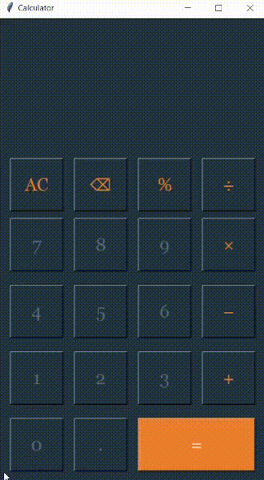

    <h1>Calculator</h1>
    

<h2>Overview</h2>

This is a simple calculator project written in Python that can perform basic arithmetic operations such as addition, subtraction, multiplication, and division.

<h2>Features</h2>
<ul>
    <li>Perform basic arithmetic operations</li>
    <li>User-friendly interface using Tkinter library</li>
    <li>Supports both positive and negative numbers</li>
    <li>Handles decimal numbers</li>
    <li>Clear the input fields with a single click</li>
</ul>

<h2>How to Use</h2>
<ol>
    <li>Clone the repository: <strong>`git clone https://github.com/loisjersong/calculator.git`</strong></li>
    <li>Open the terminal and navigate to the project directory</li>
    <li>Run the <strong>`calculator.py`</strong> file: <strong>`python calculator.py`</strong></li>
    <li>Enter the numbers and select the desired operation using the buttons on the calculator interface</li>
</ol>

<h2>Contributions</h2>

Contributions are welcome! If you want to improve the project, please open a pull request.

<h2>License</h2>

This project is licensed under the <a href="https://opensource.org/licenses/MIT" target="blank">MIT License</a>.

